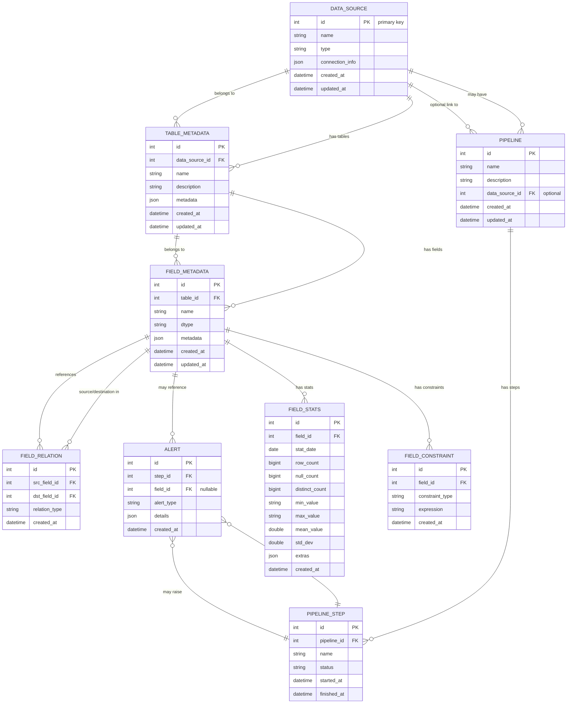

```mermaid
erDiagram
    DATA_SOURCE {
        int id PK "primary key"
        string name
        string type
        json connection_info
        datetime created_at
        datetime updated_at
    }

    TABLE_METADATA {
        int id PK
        int data_source_id FK
        string name
        string description
        json metadata
        datetime created_at
        datetime updated_at
    }

    FIELD_METADATA {
        int id PK
        int table_id FK
        string name
        string dtype
        json metadata
        datetime created_at
        datetime updated_at
    }

    FIELD_RELATION {
        int id PK
        int src_field_id FK
        int dst_field_id FK
        string relation_type
        datetime created_at
    }

    PIPELINE {
        int id PK
        string name
        string description
        int data_source_id FK "optional"
        datetime created_at
        datetime updated_at
    }

    PIPELINE_STEP {
        int id PK
        int pipeline_id FK
        string name
        string status
        datetime started_at
        datetime finished_at
    }

    ALERT {
        int id PK
        int step_id FK
        int field_id FK "nullable"
        string alert_type
        json details
        datetime created_at
    }

    FIELD_STATS {
        int id PK
        int field_id FK
        date stat_date
        bigint row_count
        bigint null_count
        bigint distinct_count
        string min_value
        string max_value
        double mean_value
        double std_dev
        json extras
        datetime created_at
    }

    FIELD_CONSTRAINT {
        int id PK
        int field_id FK
        string constraint_type
        string expression
        datetime created_at
    }

    %% Relationships
    DATA_SOURCE ||--o{ TABLE_METADATA : "has tables"
    TABLE_METADATA ||--o{ FIELD_METADATA : "has fields"
    FIELD_METADATA ||--o{ FIELD_STATS : "has stats"
    FIELD_METADATA ||--o{ FIELD_CONSTRAINT : "has constraints"

    FIELD_METADATA ||--o{ FIELD_RELATION : "source/destination in"
    FIELD_RELATION }o--|| FIELD_METADATA : "references"

    DATA_SOURCE ||--o{ PIPELINE : "may have"
    PIPELINE ||--o{ PIPELINE_STEP : "has steps"
    PIPELINE_STEP ||--o{ ALERT : "may raise"
    FIELD_METADATA ||--o{ ALERT : "may reference"

    %% Optional convenience links
    TABLE_METADATA }o--|| DATA_SOURCE : "belongs to"
    FIELD_METADATA }o--|| TABLE_METADATA : "belongs to"
    PIPELINE }o--|| DATA_SOURCE : "optional link to"
    ALERT }o--|| PIPELINE_STEP : "belongs to"
```